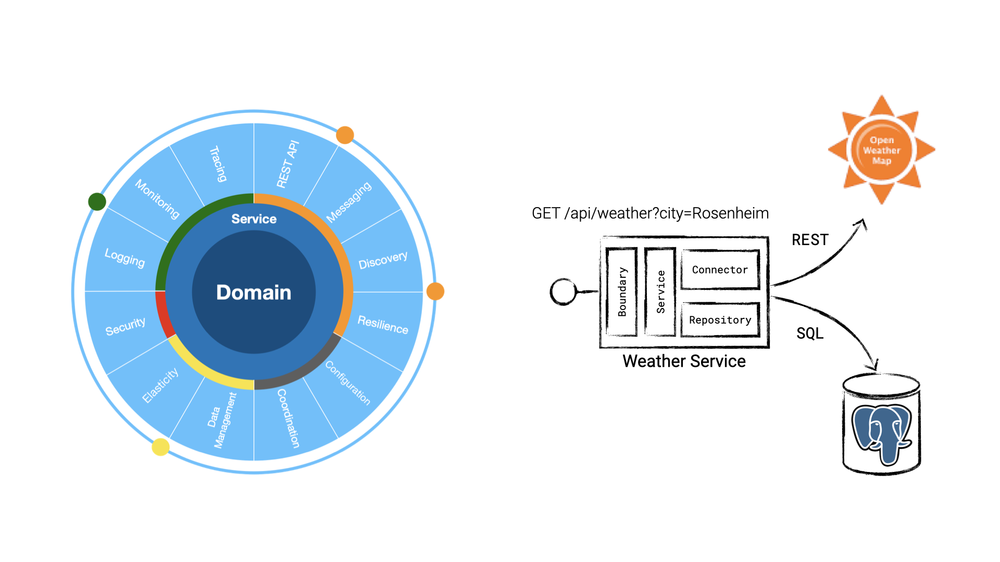

# Cloud-native Weather Service with JavaEE

This example implements a simple weather REST service using Payara Micro, JavaEE and Microprofile APIs.



## Build and run locally

```bash
$ mvn package
$ tilt up
$ skaffold dev --no-prune=false --cache-artifacts=false
```

## Exercise the application

```bash
$ curl -X GET http://localhost:18080/api/weather\?city\=Rosenheim
{"city":"Rosenheim","weather":"Sunshine"}

$ curl -X GET http://localhost:18080/

$ curl -X GET http://localhost:18080/metrics

$ curl -X GET http://localhost:18080/health
$ curl -X GET http://localhost:18080/health/ready
$ curl -X GET http://localhost:18080/health/live
```

## Maintainer

M.-Leander Reimer (@lreimer), <mario-leander.reimer@qaware.de>

## License

This software is provided under the Apache v2.0 open source license, read the `LICENSE`
file for details.
